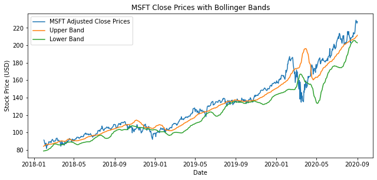

# Algorithmic-Trading-Strategy

### Bollinger Bands

Bollinger bands trading strategy is a way to use statistical data to create an upper and lower bound to base your trades off of.  
Typically, the Upper bound takes the standard deviation of the rolling simple moving average of a stock, multiplies it by 2, and then adds that value to the rolling simple moving average.  This results in the upper bound consistently being 2 Standard Deviations above the mean.
The Lower bound would be the same as the Upper bound except it would subtract the 2 Standard Deviations by the mean.
The theory behind why this works is based on the concept, "Regression toward the Mean", where a point (in this case) past 2 Standard Deviations of the mean will likely regress back towards the mean in the future.

### The Trading Strategy

For my trading strategy, I set up these bounds to decide when the stock would be bought and sold.  When the stock would dip below the Lower bound, I would allocate 100% of the money I was using into buying the stock.  Once the stock was bought, I would hold onto the stock until the stock rises above the Upper bound, in which case I would then sell 100% of that stock.

